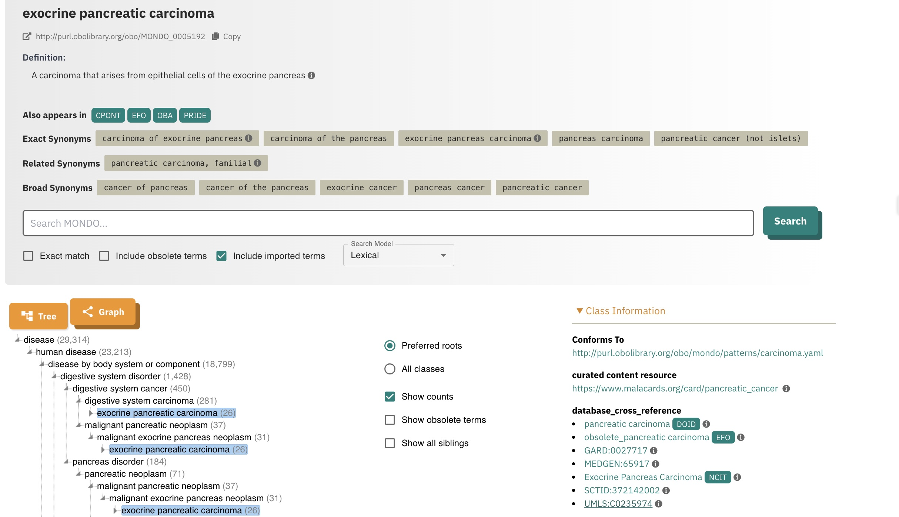
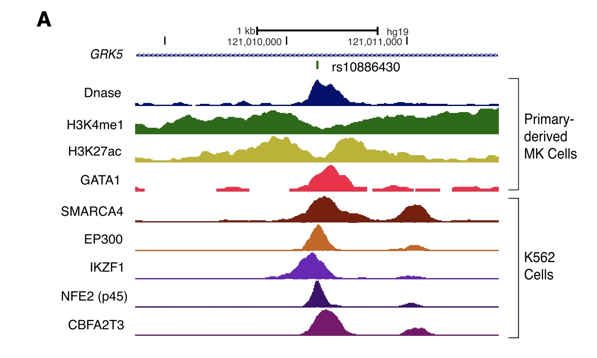

# Introduction to GWAS

This chapter introduces genome-wide association studies (GWAS), covering the
conceptual foundations and practical tools needed to design, execute, and
interpret large-scale genetic association analyses.

## Phenotype Vocabulary

At the boundaries of knowledge, it is important to establish conventions
to support clear communication.  "Ontology" is a field of information
science devoted to formal specification of vocabularies and associated
conceptual hierarchies.  Practical use of ontologies in genomic data
science started with Gene Ontology but has grown to involve frequent use of
ontologies for

- cell types
- diseases
- experimental factors and designs.

### The MONDO disease ontology

Here is an "ontological report" on the [MONDO](https://mondo.monarchinitiative.org/)
term "exocrine pancreatic carcinoma", provided
by the European Bioinformatics Institute Ontology Lookup Service:



Key elements:

- definition of the short phrase or "term"
- "IRI": a URL-like entity that can be used for web access
- "CURIE": compact universal resource identifier of fixed length (MONDO:0005192)
- snapshot of conceptual hierarchy "tree"

Let's program with the MONDO ontology.  We need to have the devtools and
remotes packages installed, and then we can install the ontoProc2
package with `BiocManager::install("vjcitn/ontoProc2")`.  Once this is
done, the following will succeed.

```{r lkmon1}
library(ontoProc2)
mondo = semsql_connect(ontology="mondo") # download on first attempt
report(mondo)
```

To get precise about phenotypes of interest, we generally want to
be able to manipulate the associated CURIEs.  To learn them for a
word or phrase of interest, `search_labels` can be used.
We'll focus on "asthma" for now.

```{r lkas1}
al = search_labels(mondo, "asthma")
al
```

Now that we know an associated CURIE, we can get additional information
about its position in the conceptual hierarchy of diseases defined in MONDO.

```{r lkas2}
ainf = get_term_info(mondo, "MONDO:0004979") 
str(ainf)
tta = get_descendants(mondo, "MONDO:0004979")
str(tta)
```

We will use an alternate representation of the MONDO ontology
that is useful for visualizing relationships.

```{r lkoi}
data("monoi", package="CSHLvc2026")
onto_plot2(monoi, tta$id, cex=.55)
```

### Review

- Ontologies are structured vocabularies characterizing a conceptual domain
- A given term maps to a fixed-length CURIE
- Web pages about ontological terms are addressed with IRIs
- The ontoProc2 package supports interactive work with ontologies

### Exercises

1. Use `search_labels` to acquire information and CURIEs related to
a disease of interest, such as hypertension, obesity.

2. Produce a plot of the "conceptual neighborhood" of the disease
you chose.  You will need a vector of MONDO CURIEs to pass
to the `onto_plot2` function.


## GWAS basics

Here's an example paper for a genome-wide association study.


This paper provides an unusually explicit presentation of the basic result: the distribution
of a continuous outcome is shown to vary systematically by SNP genotype.


To help unearth the mechanisms underlying the observed relationship,
reference information on chromatin accessibility and transcription factor binding experiments is
provided.



A basic aim of this section is to mobilize Bioconductor and other
genomics data science resources to improve interpretability of GWAS results.

## GWAS "Catalog"

We take for granted the existence of a catalog of genome wide association
studies (GWAS). We will start to unpack this research concept.
This table gives a flavor of topics that have been studied in this way.

```{r lkcat}
library(gwascat)
library(DT)
library(S4Vectors)
data("gwc_110626", package="CSHLvc2026")
#
# the following code produces an arbitrary collection of records
# from the gwas catalog, one per study instead of one per SNP
#
wrap_pmid = function(x)
  sprintf("<a href='https://pubmed.ncbi.nlm.nih.gov/%s' target='_blank'>%s</a>", x, x)
dids = (1:1000)[-which(duplicated(gwc_110626$STUDY[1:1000]))]
mc = mcols(gwc_110626[dids])
sel = as.data.frame(mc[, c("STUDY", "PUBMEDID",
  "INITIAL SAMPLE SIZE", "REPLICATION SAMPLE SIZE")])
sel$PUBMEDID = sapply(sel$PUBMEDID, wrap_pmid)
datatable(sel, escape = FALSE)
```

We've organized the table by 'STUDY' and 'PUBMEDID'.  Any given
study will produce a collection of "associations": typically
these are single-nucleotide variants for which the allele counts
are statistically associated with presence or magnitude of
some outcome.  It is reasonable to organize the entire
catalog as a "GRanges" object.

```{r lkgr1}
gwc_110626
```

Our use of ontology above does not fully prepare us for the
values found in "DISEASE/TRAIT" field of the catalog.

```{r lktrait}
unique(grep("[Aa]sthma", gwc_110626$`DISEASE/TRAIT`,value=TRUE)) |> head(10)
```

### Exercises

1. For the records identified above, in which the disease phrase includes 'asthma',
what CURIEs are employed in the catalog?  Do they make sense?

2. Pick a phenotype of epidemiological interest, determine a relevant CURIE, and
find it in the catalog.  How many SNPs are associated with variation in the selected phenotype?


## Functional Interpretation

Identifying a significant SNP is only the beginning. This section covers
post-GWAS functional annotation — including regulatory element overlap, eQTL
colocalization, gene prioritization strategies, and pathway enrichment — to
move from statistical association to biological insight.
