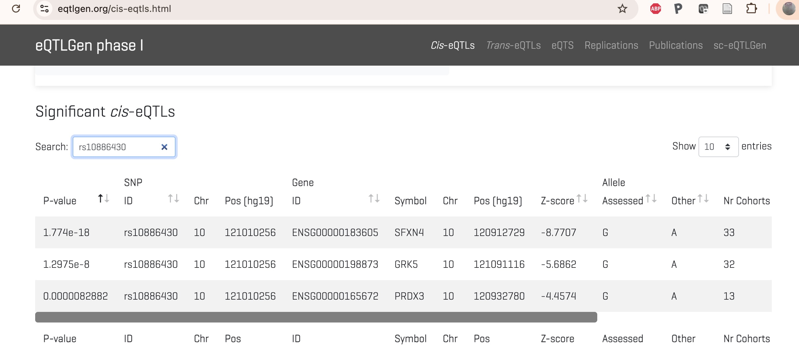
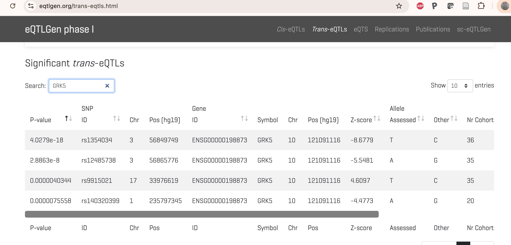

# Quantitative trait loci for molecular phenotypes (xQTL)

At the inception of Mendelian genetics, traits studied were discrete
characteristics.  Quantitative trait loci (QTLs) are genetic
elements that are associated with "continuous" quantitative
characteristic.

"QTL mapping" has a long tradition.  Essentially, in a collection
of study subjects, an outcome is measured, for example, weight,
and then chromosomes are scanned for variants that show association
with variation in the outcome.

The figure from Johnson's study in 1.2 above is an example.  The
trait is a score for platelet aggregation, and the variant is the
SNP rs10886430.  The functional followup of the hit focused on
possible effects of the variant on transcription factor binding.
This could be considered a followup using "reference" information,
specifically obtained through ChIP-seq on cultured cell lines.

Another approach to illuminating GWAS findings concerns colocalization
of GWAS hits with "population-level" information on other QTLs
produced using high-throughput assays.  eQTLs are genetic loci (typically
SNPs) that show association with gene expression.  mQTLs are loci
associated with variation in DNA methylation.  sQTL and pQTL are terms used for
loci associated with splicing and protein abundance respectively.

For eQTL, the quantitative phenotype may have 20,000-60,000 features (genes
or transcripts), each of which may be tested for association with
millions of SNP genotypes.  Computational burdens and 
multiple testing adjustments required for such general
searches are significant.  Two species of testing practices
are commonly distinguished:

- _cis_ searches: each molecular phenotype is tested for association
with variants "nearby" on the same chromosome

- _trans_ searches: all tests that are not _cis_ are considered

A research consortium "eQTLgen" collects information on eQTL studies.
We can check for _cis_ findings on rs10886430:

There are also _trans_ findings for GRK5 expression:

The lead SNP in the Johnson figure is associated with
expression of three different genes in _cis_, and GRK5
expression is associated with four different SNPs in _trans_.
Do these findings help elucidate mechanisms of thrombin-associated
platelet aggregation?

In this section we aim to understand how to structure
data and perform searches for xQTL, and to carry out
tasks of integrative interpretation.
